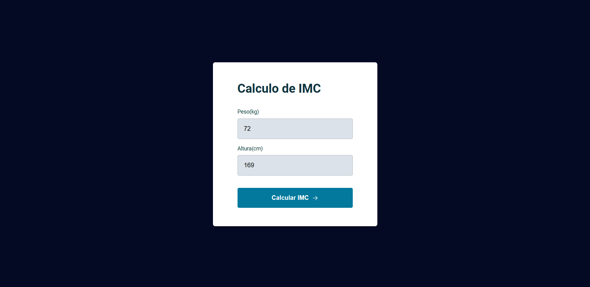
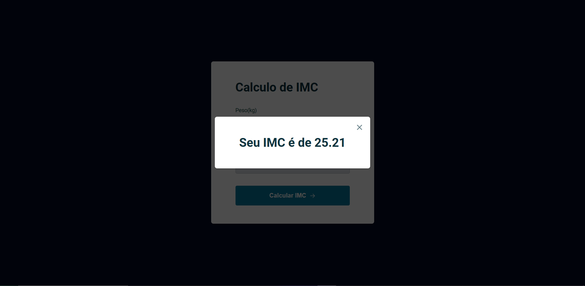

# Projeto Calculadora IMC | Trilha Explorer

---

## Tecnologias 

  

---

## O que aprendi

- Criar estilos para o formulário
- Criar o modal
- Construindo a caixa de alerta de erro
- JavaScript com o evento de submit
- Apresentar resultado no popup
- Estruturar dados no modal
- ES6 Modules
- Modularizar o modal popup
- Fechar o madal pelo teclado
- Validar dados
- Modularizar caixa de erro
- Modularizar funções utilitarias
- Refatorar o submit, aplicando o Clean Code

---

## Contato

<a href = "mailto:probertos717@gmail.com">